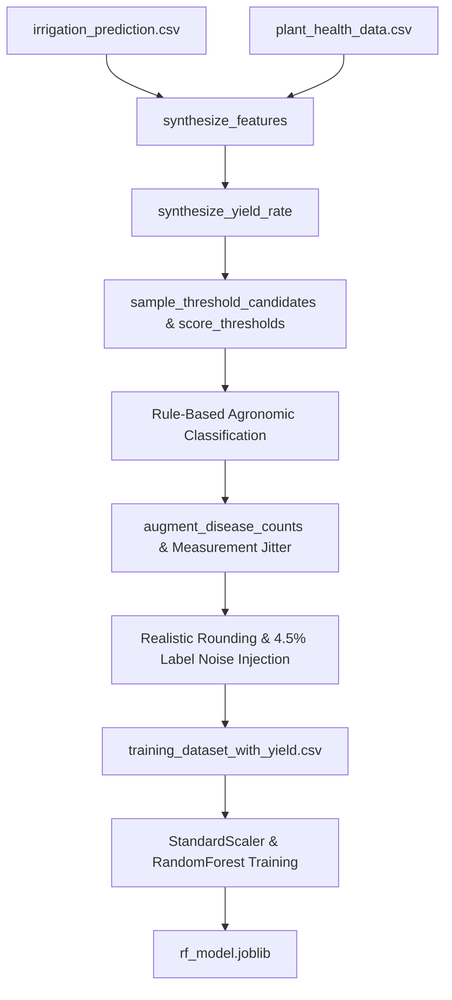
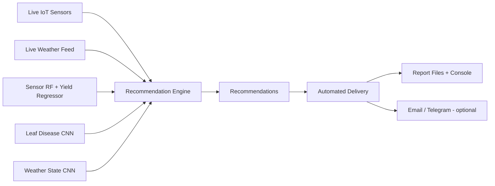
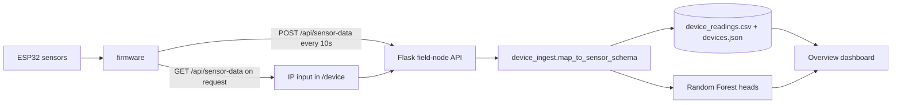

# Comprehensive Agronomic Health Analysis, Yield Estimation & Vision Architecture Specification

An end-to-end multi-modal Artificial Intelligence and Machine Learning framework for **agronomic crop health analysis, rule-based disease synthesis, telemetry yield rate regression, computer vision leaf disease diagnosis, and satellite weather forecasting**.

This repository is organized into four dedicated, self-contained model subsystems and one application layer:
1. **IoT Sensor & Telemetry ML System (`./sensor_model/`)**: A tabular machine learning pipeline using Random Forest classification and continuous score synthesis to model soil/climate telemetry, optimize agronomic rule thresholds, calculate `Yield_Rate` metrics, and provide live interactive inference utilities (`test.py`) and visual reporting (`visualize.py`).
2. **Leaf Disease Computer Vision System (`./leaf_disease_model/`)**: A PyTorch deep learning pipeline utilizing transfer learning (`EfficientNet-B0` & `ResNet50`) with automated image augmentation to diagnose plant leaf diseases from multi-class field photography.
3. **Satellite Weather Prediction System (`./satellite_weather_model/`)**: A PyTorch Convolutional Neural Network (`Net`) pipeline for weather-state classification using real optical weather imagery (cloud / rain / shine / sunrise) with a synthetic fallback dataset generator.
4. **Farm Advisory Application Layer (`./farm_advisory/`)**: The production integration layer - live weather feed (Open-Meteo), live IoT sensor ingestion, ESP32 field-node ingestion, a rule-and-model fused recommendation engine, and automated report delivery (file + console, optional email/Telegram).
5. **Web UI (`./web_ui/`)**: A self-contained Flask dashboard exposing every subsystem as a web tool - overview, field-node connection by IP, sensor analytics, leaf/weather-state image uploads, live weather, and the full advisory pipeline with downloadable markdown/JSON reports. Every visual is rendered by the browser as HTML, CSS or inline SVG.
6. **Hardware (`./hardware/`)**: ESP32 firmware that reads the DHT11, soil probe, BH1750, MQ-135, BME280 and SSD1306, pushes readings to the dashboard and also serves them for direct IP-address pulls.

---

## 1. Comprehensive Project Directory & Subsystem Architecture

```
Multidisciplinary_Project/
│
├── sensor_model/                             # IoT Sensor & Telemetry Machine Learning Subsystem
│   ├── dataset/
│   │   ├── plant_health_data.csv               # Empirical plant dataset (NPK nutrient & solar light distributions)
│   │   ├── irrigation_prediction.csv           # Telemetry dataset (Soil moisture, pH, temperature, humidity)
│   │   ├── training_dataset_with_yield.csv     # Synthesized & noise-injected master training set
│   │   └── selected_thresholds.json            # Optimized rule-based disease classification thresholds
│   ├── outputs/
│   │   ├── confusion_matrix.png                # Saved classification confusion matrix
│   │   ├── feature_importances.png             # Saved Gini feature importance bar chart
│   │   ├── Slide_Confusion_Matrix.png          # High-resolution slide confusion matrix graph
│   │   ├── Slide_Feature_Importance.png        # High-resolution slide feature importance graph
│   │   └── Slide_Yield_Regression.png          # Actual vs Predicted yield rate regression scatter plot
│   ├── rf_model.joblib                         # Persisted Random Forest model, StandardScaler, and LabelEncoder
│   ├── train.py                                # Master model training, threshold tuning, & dataset synthesis script
│   ├── test.py                                 # Interactive CLI predictor & yield rate evaluator script
│   └── visualize.py                            # Dedicated graph rendering and metric plotting script
│
├── leaf_disease_model/                      # PyTorch Deep Learning Computer Vision Subsystem
│   ├── dataset/
│   │   ├── train/                              # Multi-class leaf image training subset
│   │   ├── valid/                              # Validation leaf image subset
│   │   ├── test/                               # Test leaf image subset
│   │   ├── _classes.csv                        # One-hot encoded ground truth image labels
│   │   ├── README.dataset.txt                  # Roboflow dataset information notes
│   │   └── README.roboflow.txt                 # Dataset licensing and origin details
│   ├── outputs/                                # Saved visual confusion matrices and evaluation CSV logs
│   ├── best_leaf_disease_model.pth             # PyTorch trained model checkpoint weights
│   ├── train.py                                # Deep learning training pipeline (EfficientNet-B0 / ResNet50)
│   └── test.py                                 # Model inference & evaluation script on test set images
│
├── satellite_weather_model/                 # Satellite Remote Sensing Weather Forecast Subsystem
│   ├── dataset/
│   │   ├── train/{cloud, rain, shine, sunrise}/     # Real weather imagery (1,124 images, 70%)
│   │   ├── valid/{cloud, rain, shine, sunrise}/     # Validation split (15%)
│   │   └── test/{cloud, rain, shine, sunrise}/      # Test split (15%)
│   ├── outputs/                                # Training curves + confusion matrix figures
│   ├── satellite_weather_model.pth             # Trained CNN checkpoint (weights + class names)
│   ├── main.py                                 # PyTorch satellite weather forecasting CNN script
│   └── test.py                                 # Single-image inference & test-set evaluation
│
└── farm_advisory/                           # Farm Advisory Application Layer
    ├── dataset/                                # Live sensor log CSV + weather API cache
    ├── outputs/                                # Generated advisory reports (markdown + JSON)
    ├── config.py                               # Central paths, farm location & delivery settings
    ├── weather_feed.py                         # Live weather feed (Open-Meteo, no API key)
    ├── iot_ingestion.py                        # Live IoT sensor ingestion + simulator
    ├── recommendation_engine.py                # Fuses sensor/leaf/satellite models + rules
    ├── delivery.py                             # Automated recommendation delivery (file/console/email/Telegram)
    ├── device_ingest.py                        # ESP32 field-node ingestion + device registry
    ├── app.py                                  # Entry point: web UI (default) or --cli pipeline
    └── test.py                                 # Self-test of the whole advisory chain
│
└── web_ui/                                  # Flask Web Dashboard Subsystem
    ├── templates/                              # Jinja2 templates (pages + _charts macros)
    ├── static/style.css                        # Workspace design system
    ├── app.py                                  # Flask routes + field-node API
    ├── viz.py                                  # Chart geometry helpers (no image output)
    ├── model_service.py                        # Lazy-loaded, cached inference helpers
    ├── requirements.txt                        # Flask dependency pin
    ├── README.md                               # Run & usage notes
    └── uploads/                                # Runtime folder for image uploads (auto-cleaned)
│
└── hardware/                                 # Embedded Field Node
    └── esp32_farm_node/
        └── esp32_farm_node.ino                # ESP32 firmware: sensors, OLED, push + pull endpoints
```

---

## 2. Complete File & Subsystem Breakdown

| Subsystem | File / Artifact Path | Type | Functional Role & Technical Specification |
| :--- | :--- | :--- | :--- |
| **`sensor_model`** | `train.py` | Python Script | Primary tabular pipeline orchestrator. Performs feature synthesis, grid search tuning of agronomic disease thresholds, minority class augmentation, measurement jitter & label noise injection, Random Forest training, cross-validation, and artifact saving. |
| **`sensor_model`** | `test.py` | Python Script | Turnkey CLI tool for live inference. Prompts users for 8 sensor readings with ideal range guidelines, standardizes features, predicts disease diagnosis with probability distribution, and calculates `Yield_Rate`. |
| **`sensor_model`** | `visualize.py` | Python Script | Plotting utility. Loads `rf_model.joblib` and `training_dataset_with_yield.csv` to generate slide-ready plots for feature importances, confusion matrix, and actual vs. predicted yield rates. |
| **`sensor_model`** | `dataset/plant_health_data.csv` | CSV Data | Empirical plant health dataset supplying observed probability distributions for Soil Nitrogen, Phosphorus, Potassium levels, and incident Solar Light Intensity. |
| **`sensor_model`** | `dataset/irrigation_prediction.csv` | CSV Data | Environmental telemetry dataset providing ambient Temperature, Relative Humidity, Soil Moisture, and Soil pH readings. |
| **`sensor_model`** | `dataset/training_dataset_with_yield.csv` | CSV Data | Primary training dataset containing rounded sensor values, synthesized continuous `Yield_Rate`, injected label noise, and target disease classes. |
| **`sensor_model`** | `dataset/selected_thresholds.json` | JSON Config | Serialized JSON file storing the optimal threshold boundaries selected during cross-validation tuning. |
| **`sensor_model`** | `rf_model.joblib` | Model Binary | Serialized Joblib dictionary containing trained `RandomForestClassifier`, **trained `RandomForestRegressor` (Yield_Rate)**, `StandardScaler`, and target `LabelEncoder`. |
| **`leaf_disease_model`** | `train.py` | Python Script | PyTorch deep vision training script. Implements `LeafDataset`, transfer learning architectures (`EfficientNet-B0`, `ResNet50`), data augmentation transforms, mixed-precision training, and model checkpointing. |
| **`leaf_disease_model`** | `test.py` | Python Script | Inference & evaluation script for single image classification or batch test set metric calculation (Accuracy, Precision, Recall, F1-Score). |
| **`leaf_disease_model`** | `best_leaf_disease_model.pth` | Model Binary | Saved PyTorch model checkpoint weights containing trained state dictionary, epoch number, validation accuracy, F1-score, and class names. |
| **`satellite_weather_model`** | `main.py` | Python Script | PyTorch CNN script (`Net`) for weather-state classification. Loads the prepared real image dataset (`dataset/train|valid|test`), trains with mixed precision, early-stops on validation accuracy, and persists the best checkpoint. Falls back to `SyntheticWeatherDataset` when no real data exists. |
| **`satellite_weather_model`** | `test.py` | Python Script | Inference & evaluation for the weather CNN - single-image classification (`--single`) or full test-set metrics with a confusion-matrix CSV/PNG. |
| **`satellite_weather_model`** | `satellite_weather_model.pth` | Model Binary | Saved PyTorch checkpoint with trained weights, epoch, validation accuracy and the 4 weather class names. |
| **`farm_advisory`** | `config.py` | Python Script | Central configuration - model artifact paths, farm latitude/longitude, agronomic thresholds, weather cache TTL and delivery settings (email/Telegram disabled by default). |
| **`farm_advisory`** | `weather_feed.py` | Python Script | Live weather feed module. Polls the Open-Meteo API (no key required) for current conditions + 3-day forecast, caches snapshots on disk, and degrades to cached/offline fallback on network failure. |
| **`farm_advisory`** | `iot_ingestion.py` | Python Script | Live IoT sensor ingestion. `SensorIngestion` validates, clamps and appends 8-feature telemetry to `dataset/sensor_log.csv`; `SimulatedSensorNode` emits realistic streaming readings with a diurnal cycle, drift and configurable stress profiles. |
| **`farm_advisory`** | `device_ingest.py` | Python Script | ESP32 field-node ingestion. Maps the firmware payload (`soil_moisture`, `air_temperature`, `humidity`, `light_intensity`, `mq135_raw`, `bme_temperature`, `pressure`) onto the 8-feature model schema, estimates `PH`/NPK when those probes are absent, tags every value as measured or estimated, appends to `dataset/device_readings.csv`, keeps `dataset/devices.json`, and probes a node by IP address. |
| **`farm_advisory`** | `recommendation_engine.py` | Python Script | Recommendation engine. Fuses the sensor Random Forest, yield regressor, leaf disease CNN, satellite weather CNN and live weather into prioritized, evidence-backed agronomic actions (irrigation, fertilization, pH amendment, disease control, spraying windows). |
| **`farm_advisory`** | `delivery.py` | Python Script | Automated recommendation delivery. Renders markdown + JSON reports under `outputs/`, prints console summaries, and optionally pushes via SMTP email or a Telegram bot when configured. |
| **`farm_advisory`** | `app.py` | Python Script | Unified entry point. `python app.py` launches the Flask web UI (browser opens automatically); `python app.py --cli` (or passing any pipeline option such as `--steps`, `--leaf`, `--offline`) runs the end-to-end live CLI pipeline - ingest telemetry, fetch weather, run the engine and deliver reports. |
| **`farm_advisory`** | `test.py` | Python Script | Self-test of the advisory chain (healthy + stressed readings, live/cached weather, leaf image, file delivery). |
| **`web_ui`** | `app.py` | Python Script | Flask application. Serves the dashboard pages, registers the `viz` helpers as Jinja globals, and serves downloadable advisory reports from `farm_advisory/outputs/`. |
| **`web_ui`** | `viz.py` | Python Script | Geometry-only chart helpers. Builds CSS `conic-gradient` donuts, gauge arcs and needle positions, radar polygons, sparkline polyline points and forecast bar geometry. No image or file is produced - the browser draws everything. |
| **`web_ui`** | `model_service.py` | Python Script | Shared inference layer. Lazy-loads and caches every trained artifact (sensor bundle, EfficientNet-B0, weather CNN), reads the logged telemetry history, produces live simulated-node readings, and resolves farm defaults and report delivery. All deep models run on CPU. |
| **`web_ui`** | `templates/_charts.html` | Jinja2 Macros | Chart component library: `donut`, `radar`, `rangebars`, `sparkgrid`, `forecast`, `flow` and `suggestions`, composed from HTML, CSS and inline SVG. |
| **`web_ui`** | `templates/*.html` | Jinja2 Templates | `base.html` (workspace shell: sidebar, top bar, footer) plus four page templates: overview, field node, vision and advisory. |
| **`web_ui`** | `static/style.css` | CSS | Workspace design system — design tokens, sidebar and top bar, metric cards, panel cards, flow lanes, donut, radar, range bars, sparklines, forecast columns, tables, suggestion cards and sliders. |
| **`web_ui`** | `uploads/` | Runtime Data | Temporary storage for uploaded leaf/sky images; files and the folder are removed after inference to keep the tree tidy. |
| **`web_ui`** | `README.md` | Documentation | How to install requirements, start the server, what each page shows and the chart component list. |

---

## 3. Data Engineering & Synthetic Pipeline Architecture

The `sensor_model` tabular pipeline integrates empirical telemetry with agronomic rule modeling and synthetic data augmentation to mimic field collection realities.



### 3.1 Feature Definitions & Domain Boundaries

| Feature Name | Primary Source | Range / Unit | Agronomic Significance & Precision |
| :--- | :--- | :--- | :--- |
| **`Temperature`** | `irrigation_prediction.csv` | $15.0^\circ\text{C} - 35.0^\circ\text{C}$ | Ambient canopy temperature (rounded to 2 decimal places). Drives transpiration & fungal spore germination. |
| **`Humidity`** | `irrigation_prediction.csv` | $30.0\% - 95.0\%$ | Relative atmospheric humidity (rounded to 2 decimal places). Primary driver for foliar bacterial and fungal pathogens. |
| **`Moisture`** | `irrigation_prediction.csv` | $10.0\% - 80.0\%$ | Volumetric soil water content (rounded to 2 decimal places). Regulates root rot risk and nutrient uptake. |
| **`PH`** | `irrigation_prediction.csv` | $4.5 - 8.5\text{ pH}$ | Soil hydrogen ion concentration (rounded to 2 decimal places). Determines soil nutrient availability. |
| **`Nitrogen`** | `plant_health_data.csv` | $10.0 - 100.0\text{ mg/kg}$ | Essential soil Nitrogen concentration (rounded to 2 decimal places). Promotes vegetative growth. |
| **`Phosphorus`** | `plant_health_data.csv` | $10.0 - 80.0\text{ mg/kg}$ | Soil Phosphorus concentration (rounded to 2 decimal places). Crucial for root development and energy transfer. |
| **`Potassium`** | `plant_health_data.csv` | $10.0 - 80.0\text{ mg/kg}$ | Soil Potassium concentration (rounded to 2 decimal places). Enhances disease resistance and stomatal regulation. |
| **`Light_Intensity`** | `plant_health_data.csv` | $200.0 - 1000.0\text{ Lux}$ | Incident solar radiation (rounded to 1 decimal place). Regulates photosynthetic rate and pathogen inhibition. |
| **`Yield_Rate`** | Multi-Factor Formula | $10.0 - 100.0\text{ Score}$ | Continuous crop productivity index incorporating soil nutrient balance, moisture, and climate adequacy. |
| **`Target_Disease`** | Rule Engine | 6 Categorical Classes | Health status label: `Healthy`, `Early_Blight`, `Root_Rot`, `Powdery_Mildew`, `Rust`, `Bacterial_Leaf_Spot`. |

---

### 3.2 Mathematical Formulation of Agronomic Scores & Synthetic Noise

#### A. Continuous Yield Rate Synthesis
The `Yield_Rate` calculation normalizes individual features against empirical bounds before computing a weighted sum with additive Gaussian noise:

$$\text{Norm}(X, a, b) = \text{clip}\left(\frac{X - a}{b - a}, 0.0, 1.0\right)$$

$$\text{Score} = 0.20 \cdot \text{Norm}(N, 10, 100) + 0.15 \cdot \text{Norm}(P, 10, 80) + 0.15 \cdot \text{Norm}(K, 10, 80) + 0.20 \cdot \text{Norm}(\text{Moisture}, 20, 70) + 0.15 \cdot \text{Norm}(\text{pH}, 5, 8) + 0.10 \cdot \text{Norm}(\text{Light}, 200, 1000) + 0.05 \cdot \text{Norm}(\text{Humidity}, 30, 90)$$

$$\text{Yield\_Rate} = \text{clip}\left(20.0 + 60.0 \cdot \text{Score} + \mathcal{N}(\mu=0, \sigma=4.0), 10.0, 100.0\right)$$

#### B. Deterministic Agronomic Rule Engine
Disease classification targets are assigned using multi-variable environmental rule conditions:
- **Root Rot**: $\text{Moisture} > T_{\text{Moisture}} \land \text{pH} < T_{\text{pH}}$
- **Powdery Mildew**: $T_{\text{temp,low}} \le \text{Temperature} \le T_{\text{temp,high}} \land \text{Humidity} > T_{\text{Humidity}} \land \text{Light\_Intensity} < T_{\text{Light}}$
- **Early Blight**: $\text{Temperature} \ge T_{\text{Temperature}} \land \text{Humidity} > T_{\text{Humidity}} \land \text{Nitrogen} < T_{\text{Nitrogen}}$
- **Rust**: $\text{Temperature} < T_{\text{Temperature}} \land \text{Humidity} > T_{\text{Humidity}} \land \text{Moisture} > T_{\text{Moisture}}$
- **Bacterial Leaf Spot**: $\text{Temperature} \ge T_{\text{Temperature}} \land \text{Humidity} > T_{\text{Humidity}} \land \text{pH} > T_{\text{pH}}$
- **Healthy**: Assigned when no environmental stress threshold is breached.

#### C. Threshold Grid Tuning & Cross-Validation
The pipeline generates candidate threshold dictionaries $C_1, C_2, \dots, C_{15}$ via randomized sampling over realistic agronomic ranges. For each candidate set $C_k$, 3-fold cross-validation computes the Macro F1 Score $\bar{F}_1$ and non-healthy sample ratio $R_{\text{non-healthy}}$. The candidate maximizing F1 score subject to $R_{\text{non-healthy}} \ge 0.10$ is persisted to `selected_thresholds.json`.

#### D. Measurement Jitter & Label Noise Injection
To prevent artificial over-fitting:
1. **Measurement Jitter**: For each feature $j$, random noise is added:
   $$X_{ij} \leftarrow X_{ij} + \mathcal{N}\left(0, 0.02 \cdot \sigma_{X_j}\right)$$
2. **Field Label Misclassification**: Exactly $4.5\%$ of samples undergo ground-truth label swapping:
   $$y_i \leftarrow \text{RandomChoice}\left(\mathcal{C} \setminus \{y_i\}\right)$$

---

## 4. Machine Learning & Deep Learning Specifications

### 4.1 Random Forest Classifier (`sensor_model/train.py`)

#### A. Mathematical Principles & Bagging Formulation
The Random Forest model is constructed using an ensemble of $B = 150$ independent decision trees grown via Bootstrap Aggregating (Bagging):
1. For tree $b = 1, \dots, B$, draw a bootstrap sample $\mathcal{Z}^*$ of size $N$ from the training set.
2. Grow a decision tree $T_b$ to the bootstrapped data by recursively partitioning nodes. At each split, select $m = \lfloor\sqrt{p}\rfloor = 2$ features at random from the total $p = 8$ features.
3. Compute Gini Impurity $G$ at node $m$:
   $$G(m) = 1 - \sum_{k=1}^K p_{mk}^2$$
   where $p_{mk}$ represents the proportion of class $k$ observations in node $m$.
4. Aggregate predictions across all $B=150$ trees using majority voting:
   $$\hat{C}(\mathbf{x}) = \text{mode}\left\{ \hat{C}_1(\mathbf{x}), \hat{C}_2(\mathbf{x}), \dots, \hat{C}_B(\mathbf{x}) \right\}$$

#### B. Hyperparameter Configuration
```python
RandomForestClassifier(
    n_estimators=150,      # 150 decision trees for variance reduction
    max_depth=12,          # Prevents over-fitting on noise-injected data
    min_samples_split=4,   # Requires 4 samples minimum to split internal nodes
    class_weight='balanced',# Balances class weights inversely proportional to frequencies
    random_state=42,       # Ensures deterministic reproducibility
    n_jobs=-1              # Multi-core CPU parallel execution
)
```

---

### 4.2 Comparative Analysis: Random Forest vs. XGBoost

While Random Forest is implemented in `sensor_model`, **XGBoost (Extreme Gradient Boosting)** serves as a key alternative for tabular telemetry analysis.

```mermaid
graph LR
    subgraph Random Forest (Parallel Bagging)
        A1[Bootstrap Sample 1] --> B1[Tree 1]
        A2[Bootstrap Sample 2] --> B2[Tree 2]
        A3[Bootstrap Sample 3] --> B3[Tree 3]
        B1 & B2 & B3 --> C[Majority Voting Mode]
    end
    
    subgraph XGBoost (Sequential Boosting)
        D1[Initial Tree 1] --> E1[Residual Error 1]
        E1 --> D2[Gradient Tree 2]
        D2 --> E2[Residual Error 2]
        E2 --> D3[Gradient Tree 3]
        D3 --> F[Weighted Sum Prediction]
    end
```

#### Comparative Architecture Matrix

| Architectural Feature | Random Forest (Current Implementation) | XGBoost (Gradient Boosting Alternative) |
| :--- | :--- | :--- |
| **Ensemble Paradigm** | **Bagging**: Parallel independent tree growth. | **Boosting**: Sequential residual reduction. |
| **Loss Optimization** | Gini Impurity reduction per node split. | 2nd-order Taylor expansion of custom objective loss. |
| **Noise Resilience** | **High**: Tree averaging absorbs Gaussian jitter and $4.5\%$ label noise gracefully. | **Moderate**: Prone to over-fitting label noise without strict $\gamma, \lambda$ regularizers. |
| **Hyperparameter Sensitivity** | **Low**: Robust defaults across varying sample sizes. | **High**: Requires careful tuning of `learning_rate` ($\eta$), `max_depth`, `subsample`. |
| **Out-of-Core Processing** | Fully parallelized across CPU threads (`n_jobs=-1`). | Accelerated via CUDA GPU histogram tree algorithms (`tree_method='hist'`). |

---

### 4.3 Computer Vision Architecture (`leaf_disease_model/train.py`)

#### A. Transfer Learning Networks (`EfficientNet-B0` & `ResNet50`)
The vision pipeline utilizes deep Convolutional Neural Networks pre-trained on ImageNet:
- **EfficientNet-B0**: Uses compound scaling to uniformly scale depth, width, and resolution using mobile inverted bottleneck convolutions (`MBConv`).
- **ResNet50**: Uses 50-layer residual skip connections ($y = F(x, \{W_i\}) + x$) to eliminate vanishing gradients during deep feature extraction.

#### B. Custom Classifier & Loss Optimization
```python
# Model Head Replacement
model.classifier = nn.Sequential(
    nn.Dropout(p=0.3, inplace=True),
    nn.Linear(in_features, num_classes)
)

# Cross-Entropy Loss with Label Smoothing
criterion = nn.CrossEntropyLoss(label_smoothing=0.1)
```
Label smoothing replaces hard one-hot targets with smoothed distributions ($q_i = (1-\epsilon) y_i + \frac{\epsilon}{K}$ where $\epsilon=0.1$), preventing network over-confidence on field leaf imagery.

---

### 4.4 Satellite Weather Forecasting CNN (`satellite_weather_model/main.py`)

The satellite subsystem implements a custom PyTorch Convolutional Neural Network (`Net`) for **weather-state classification** from optical imagery (real dataset: cloud / rain / shine / sunrise, ~1,124 images):

- **Convolutional Layer 1**: `nn.Conv2d(3, 16, kernel_size=5, padding=2)` + BatchNorm2d + ReLU + MaxPool2d(2, 2)
- **Convolutional Layer 2**: `nn.Conv2d(16, 32, kernel_size=5, padding=2)` + BatchNorm2d + ReLU + MaxPool2d(2, 2)
- **Dense Classifier**: Flatten to $32 \times 56 \times 56 = 100{,}352$ units $\rightarrow$ Linear(120) $\rightarrow$ Dropout(0.5) $\rightarrow$ Linear(84) $\rightarrow$ Linear(4 classes)

Trained with CrossEntropyLoss, AdamW + CosineAnnealingLR, mixed-precision on CUDA, early stopping on validation accuracy, and the best checkpoint is persisted to `satellite_weather_model.pth`. A `SyntheticWeatherDataset` fallback keeps the pipeline runnable when the real dataset folder is empty.

---

## 5. Farm Advisory Application Layer (`./farm_advisory/`)

The application layer turns the three trained model subsystems into a production-ready advisory product. It streams live data, computes recommendations and delivers them automatically:



Key design points:
- **Unified entry point** (`app.py`) - `python app.py` launches the Flask web UI (see section 6) and opens the browser; `python app.py --cli` — or passing any pipeline option such as `--steps`, `--leaf`, `--offline` — runs the live CLI advisory loop instead.
- **Live IoT ingestion** (`iot_ingestion.py`) validates and persists an 8-feature telemetry row per reading (`dataset/sensor_log.csv`) and includes a realistic `SimulatedSensorNode` (diurnal cycle, drift, stress profiles) so the full loop runs without hardware.
- **Live weather feed** (`weather_feed.py`) uses the free Open-Meteo API and a 30-minute on-disk cache, with a graceful fallback to cached/offline values so advisories never fail on network drops.
- **Recommendation engine** (`recommendation_engine.py`) fuses model predictions (disease probability, yield forecast, leaf diagnosis, sky condition) with agronomic thresholds (soil moisture, pH, NPK, humidity, temperature, forecast rain/heat/wind) into **prioritized actions** (High / Medium / Low) with a plain-language rationale.
- **Automated delivery** (`delivery.py`) writes timestamped markdown + JSON reports to `outputs/`, prints a console summary, and can push the same advisories via SMTP email or a Telegram bot when credentials are configured in `config.py`.

---

## 6. Web Dashboard (`./web_ui/`)

A deliberately small Flask dashboard: four pages, one job each. Models are loaded once and cached (running on CPU), and **every visual is rendered by the browser as HTML, CSS or inline SVG** - no server-side image generation, no matplotlib and no JavaScript charting library. Python only supplies coordinates, percentages and gradient strings through the `viz` helpers:

| Route | Page | Function |
| :--- | :--- | :--- |
| `/` | Overview | Live metrics (crop state, yield, top risk), the disease pie chart, the reading log, trend sparklines, the pipeline lanes and the three-day weather outlook. |
| `/device` | Field node | IP-address connection panel, reachability probe, latest reading, known-node table and the firmware payload contract. |
| `/vision` | Vision | Two image classifiers side by side: leaf disease (EfficientNet-B0) and weather state (weather CNN), each with a confidence donut and top-3 bars. |
| `/advisory` | Advisory | Slider-driven full pipeline -> ranked actions, the disease pie for the scenario, the feature profile and downloadable markdown/JSON reports. |
| `POST /api/sensor-data` | Field-node API | Ingests the ESP32 JSON payload, maps it to the 8-feature schema, stores it and returns the crop-state and yield assessment. |
| `GET /api/devices` | Field-node API | Known nodes with IP address, last reading, measured-feature count and online state. |
| `GET /api/latest` | Field-node API | Latest reading (device or simulated) with mapped features, context signals and measured/estimated provenance. |

Consolidation kept the surface small: the sensor simulator, the live-weather page
and the two vision pages of the first iteration are merged into `/advisory`,
`/` and `/vision` respectively, so no number appears in two places.

### 6.0 Field-Node Data Path



Sensor mapping and provenance rules are documented in
`farm_advisory/device_ingest.py`.

### 6.1 Chart Components

| Component | Technique | Visual |
| :--- | :--- | :--- |
| `donut` | CSS `conic-gradient` with a masked centre | disease probabilities, classifier confidence |
| `radar` | inline SVG polygons, rings and axes | sensor profile against the ideal midpoint |
| `rangebars` | HTML/CSS bars over a track | reading position inside each admissible range |
| `sparkgrid` | inline SVG polylines | telemetry trends |
| `forecast` | HTML/CSS positioned columns | 3-day temperature range and precipitation |
| `flow` | HTML/CSS nodes with arrow connectors | signal-flow lanes (input to model to output) |
| `suggestions` | HTML cards | ranked advisory actions with priority badges |

### 6.2 Design Points
- **Workspace shell** - a fixed sidebar (brand, navigation, node status card), a sticky top bar with breadcrumbs and live-node state, and a content column built from metric cards, panel cards, data tables and suggestion lists.
- **Slider-based simulator** - the advisory inputs use `input[type=range]` with live readouts and a JS-painted progress track, replacing plain number boxes.
- **Single inference layer** (`model_service.py`) - every model artifact (sensor `rf_model.joblib`, leaf checkpoint, satellite checkpoint) is loaded lazily into a module-level singleton and reused across requests.
- **Geometry-only Python** (`viz.py`) - pure functions for donut gradients, radar polygons, sparkline points, forecast bars and history statistics, registered as Jinja globals. Nothing is rasterised.
- **Reusable macros** - `_charts.html` exposes every visual as a Jinja macro, so pages compose charts declaratively and the markup stays semantic and accessible (`role="img"`, `aria-label`).
- **Typography and icons** - Manrope and Font Awesome load from a CDN; charts have no external dependency and the layout degrades cleanly if the font or icon set fails to load.
- **Clean runtime behaviour** - uploaded images are saved to `uploads/` with a unique name, processed, then removed so the repository stays tidy.
- **Report downloads** are served through a validated route (`secure_filename`) with no filesystem traversal risk.
- The Flask development server is intended for local/demo use; production deployments should run it behind a WSGI server such as `waitress` or `gunicorn`.

---

## 7. Software Dependencies & Libraries

| Library | Version / Requirement | Role & Applied Modules |
| :--- | :--- | :--- |
| **`numpy`** | Standard | Matrix operations, Gaussian noise synthesis (`default_rng`), vector rounding, statistical metrics. |
| **`pandas`** | Standard | CSV I/O, DataFrame filtering, row-wise rule application, synthetic yield rate calculation. |
| **`scikit-learn`** | Standard | `RandomForestClassifier`, `StandardScaler`, `LabelEncoder`, `train_test_split`, `cross_val_score`, `classification_report`, `confusion_matrix`. |
| **`torch`** | PyTorch Core | `nn.Module`, `DataLoader`, `optim.AdamW`, `optim.lr_scheduler.CosineAnnealingLR`, mixed precision `torch.amp`. |
| **`torchvision`**| Torch Vision | Pre-trained models (`models.efficientnet_b0`, `models.resnet50`), image transforms (`Resize`, `RandomRotation`, `ColorJitter`, `Normalize`). |
| **`matplotlib`** | Standard | Figure rendering, figure exporting (`savefig`), axis formatting, color maps. |
| **`seaborn`** | Standard | Heatmap rendering (`sns.heatmap`), barplots (`sns.barplot`). |
| **`joblib`** | Standard | Model dictionary serialization (`joblib.dump`) and binary deserialization (`joblib.load`). |
| **`Pillow (PIL)`**| Standard | Image file reading (`Image.open`), RGB conversions (`convert('RGB')`). |
| **`Flask`** | 3.x | Web UI subsystem - routing, request handling, multipart uploads, template rendering, static asset serving. |
